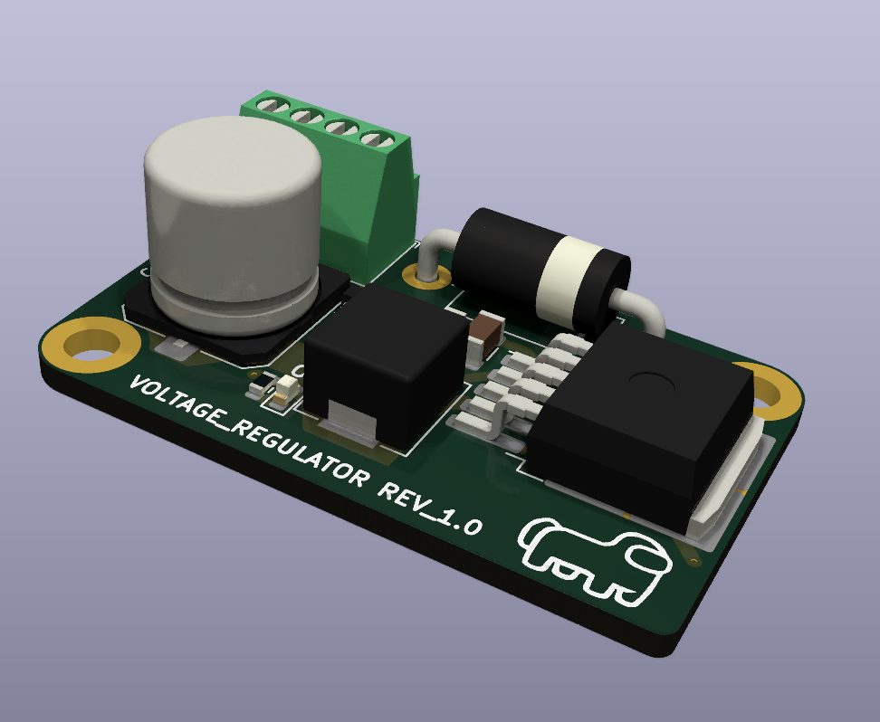
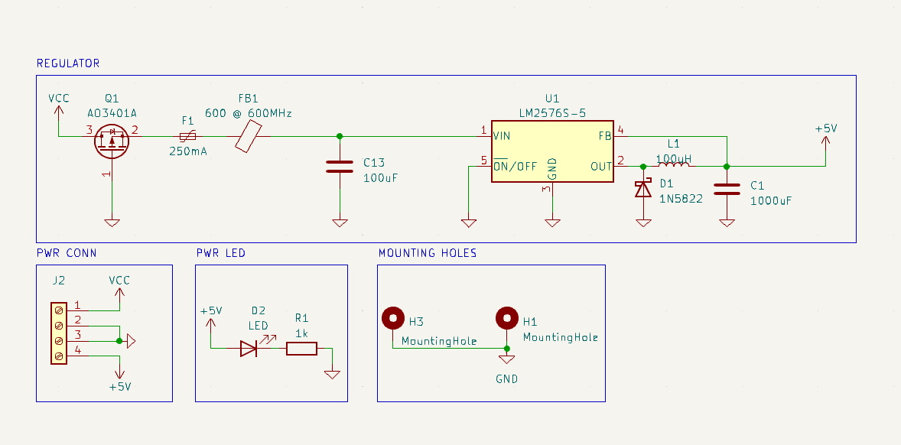
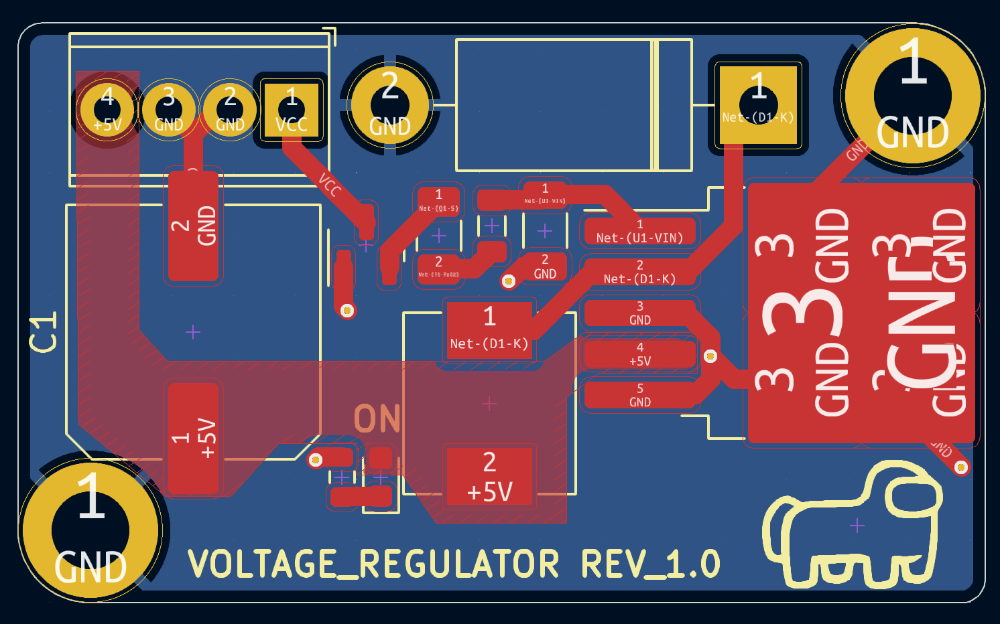

# Basic 5V Regulator for Raspberry Pi

## Introduction

This 5V regulator was designed for my EGH419 Class (Mechatronics design 3). It was designed to take the high input voltage the main robot ran off, (a 6s lipo drone battery or 4 individual 18650 cells in parallel) and output a consistent 5V for the raspberry pi to run off. The regulator needed to be capable of providing enough current for the Pi to run OpenCV object recognition on top of the navigation code. 

## Features

- Input Voltage: 30V (maximum)
- Output Voltage: 5V
- High Current Output

### Schematic
The schematic for this PCB was designed in KiCAD, KiCAD was used because it is a free program and I do not need to mess around with Educational Licences like I did when working in Altium.

### PCB
The PCB was designed and sent to JLCPCB to be manufactured (Manufacturing and Gerber files provided).

### Final Product
With the PCB now manufactured it was tested and placed into the robot. It worked well, providing 5V to the Raspberry Pi without any annoying low power warnings like the previous solution had done.

